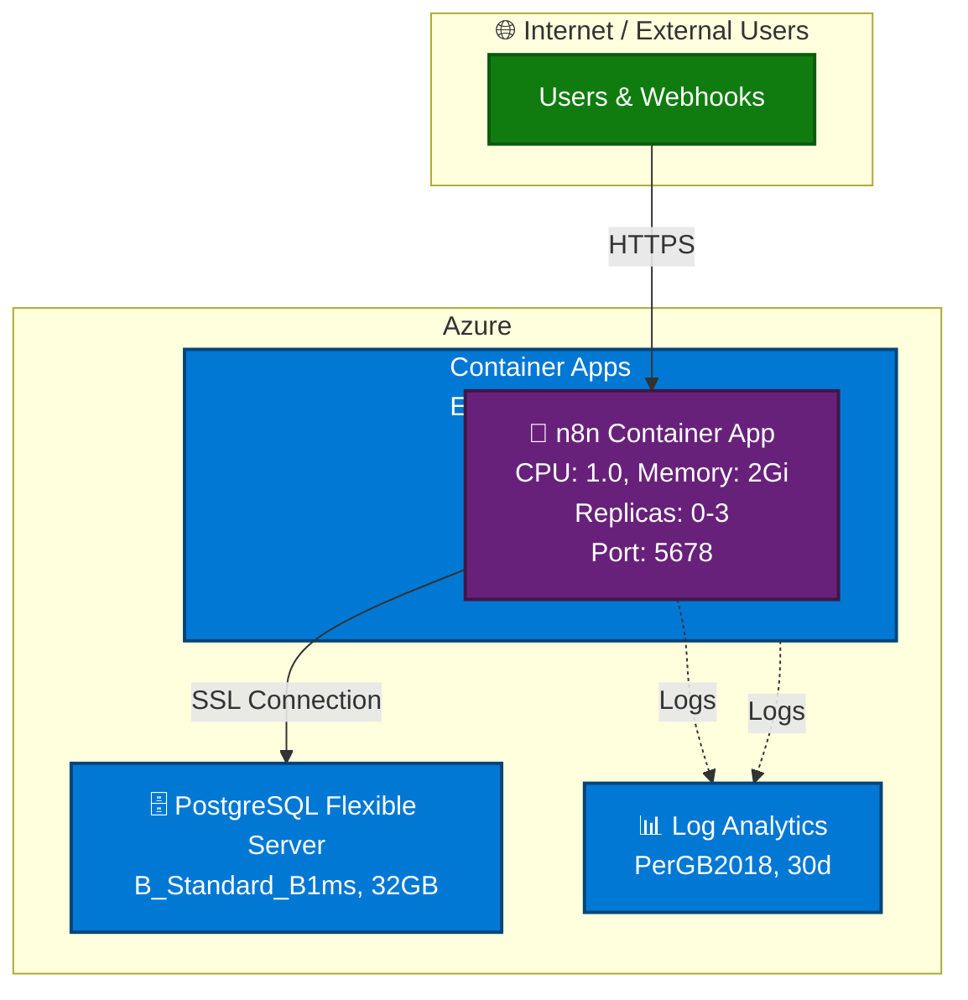

# Chapter 3: Automating n8n Deployments with GitHub Copilot Agents

In this chapter, you'll learn how to deploy production-ready infrastructure using specialized GitHub Copilot agents. You'll deploy n8n (a workflow automation platform) to Azure using either Bicep or Terraform, while GitHub Copilot agents handle the complexity of infrastructure-as-code generation, best practice validation, and automated deployment. This hands-on chapter demonstrates how AI agents can transform deployment workflows from hours to minutes.

**Prerequisites**: [Chapter 0: Course Setup](../00-course-setup/README.md), [Chapter 1: First Deployment](../01-first-deployment/README.md)

## Quick Navigation
- [Part 1: Meet the Specialized Agents](#part-1-meet-the-specialized-agents)
- [Part 2: Bicep Agent Deployment](#part-2-bicep-agent-deployment)
- [Part 3: Terraform Agent Deployment](#part-3-terraform-agent-deployment)
- [Part 4: Troubleshooting](#part-4-troubleshooting-common-issues)
- [Part 5: Assignment](#part-5-assignment)

## 🎯 Learning Objectives
- ✅ Understand when to choose the Bicep or Terraform GitHub Copilot agent for Azure work
- ✅ Practice selecting specialized agents inside GitHub Copilot Chat → [agent mode](../GLOSSARY.md#agent-mode)
- ✅ Use Azure MCP tooling (best practices, schema, deploy plans) before letting an agent create resources
- ✅ Deploy n8n into [Azure Container Apps](../GLOSSARY.md#azure-container-apps) with [PostgreSQL Flexible Server](../GLOSSARY.md#postgresql) and [Log Analytics](../GLOSSARY.md#log-analytics)
- ✅ Verify deployments via Portal, CLI, and agent-mode queries
- ✅ Clean up all resources immediately after completing exercises

## Real-World Scenario

Your automation team wants a managed n8n instance in Azure so business users can design workflows without touching production systems. They would like to deploy n8n using infrastructure-as-code, following Azure best practices for security, scalability, and cost management. 

## Resource Plan

**Region**: The agent will use `westus` by default, but you can specify another region if desired.
**SKUs**: [Container Apps](../GLOSSARY.md#azure-container-apps) consumption, [PostgreSQL](../GLOSSARY.md#postgresql) B_Standard_B1ms, [Log Analytics](../GLOSSARY.md#log-analytics) PerGB2018

> **Cost Note**: This chapter deploys paid services. Clean up resources immediately after completing the exercises to minimize costs.

## Architecture Overview

This deployment creates a production-ready n8n environment on Azure with the following components:



### Why This Architecture?

This deployment uses Azure Container Apps, which can automatically scale down to zero replicas when not in use, eliminating compute costs during idle periods. This is especially valuable for n8n, a workflow automation tool that runs background tasks and benefits from container orchestration. Container Apps also provides built-in health probe support, which prevents the platform from terminating containers before applications finish initializing.

For the database, we're using PostgreSQL Flexible Server because it provides managed backups with point-in-time restore, built-in high availability, and excellent performance. The managed service handles encryption, SSL connections, and compliance requirements automatically, while keeping the database lifecycle independent of your application containers.

We'll use Azure Developer CLI (azd) to simplify the deployment workflow. Running `azd up` handles all resource dependencies and deployment order automatically, whether you choose Bicep or Terraform. The tool also supports [post-provision hooks](../GLOSSARY.md#post-provision-hooks) that configure settings like WEBHOOK_URL after the Container App's FQDN is assigned, ensuring repeatable deployments across your team.

---

## Part 1: Meet the Specialized Agents

This chapter provides two specialized GitHub Copilot agents: one for [Bicep](../GLOSSARY.md#bicep) and one for [Terraform](../GLOSSARY.md#terraform). **If you don't already have a preference for Terraform, use the Bicep agent**—it's simpler for Azure-only deployments. Use the Terraform agent if your organization already uses Terraform workflows or manages multi-cloud infrastructure. See [Bicep vs. Terraform](../GLOSSARY.md#bicep-vs-terraform) in the glossary for detailed comparison.

To select an agent, open GitHub Copilot Chat (`Cmd+Shift+I` / `Ctrl+Shift+I`), in the agent mode selector, select either `n8n-deployment.bicep` or `n8n-deployment.terraform` from the dropdown. Verify the agent name appears in your chat input area before proceeding.

### What These Agents Do

Both specialized agents validate your deployment against Azure best practices before generating any code. They automatically call [Azure MCP](../GLOSSARY.md#azure-mcp) tools to retrieve guidance on infrastructure patterns, security configurations, and resource schemas. After generating the complete project structure—including `azure.yaml`, infrastructure templates, [post-provision hooks](../GLOSSARY.md#post-provision-hooks), and `.gitignore` files, the agents show you everything for review before execution.

The [post-provision hooks](../GLOSSARY.md#post-provision-hooks) configure settings like `WEBHOOK_URL` after your Container App receives its fully qualified domain name. All critical configurations are embedded, including proper health probe timeouts and PostgreSQL SSL settings, following security best practices like managed identities and HTTPS-only access.

> ⚠️ **Safety Reminder**: As you select **Allow**, the agents will generate code and run actual deployments. Always review the generated code and commands first.

---

## Part 2: Bicep Agent Deployment

### Technical Details (Bicep)

**Health Probes**

n8n is a Node.js application that requires time to initialize. Incorrect health probe settings can be a cause of failed deployments:

- **Liveness probe**: `initialDelaySeconds: 60`
  - **Why**: n8n requires at least 60 seconds to start its web server after the container launches
  - **What happens if wrong**: Container Apps kills the container thinking it's unhealthy

- **Startup probe**: `failureThreshold: 30` with 10-second intervals
  - **Why**: Allows up to 5 minutes (30 × 10s = 300s) for the first startup
  - **What happens if wrong**: Container never becomes ready, stuck in "CrashLoopBackOff" state

- **Why this matters**: Without these settings, [Azure Container Apps](../GLOSSARY.md#azure-container-apps) may terminate the container before n8n finishes initializing, resulting in a restart loop

**Database Connection Requirements**: You must use the PostgreSQL server's fully qualified domain name (FQDN) in connection strings, not the short name. Enable SSL with `DB_POSTGRESDB_SSL_ENABLED=true` and set `DB_POSTGRESDB_SSL_REJECT_UNAUTHORIZED=false` for Azure PostgreSQL certificate validation. Use a 60-second connection timeout to handle cold starts, and configure the firewall to allow Azure services.

**WEBHOOK_URL Configuration**: The WEBHOOK_URL cannot be set during initial creation due to a circular dependency with the Container App's FQDN. The [post-provision hook](../GLOSSARY.md#post-provision-hooks) runs automatically after `azd up` completes and updates this environment variable for you.

### Kickoff Prompt

**Step 1**: Select the **n8n-deployment.bicep** agent in GitHub Copilot Chat:
1. Open GitHub Copilot Chat (`Cmd+Shift+I` / `Ctrl+Shift+I`)
2. Set the agent selection mode to **n8n-deployment.bicep** using the dropdown at the bottom

> **Note**: The Bicep agent file is named `n8n-deployment.bicep.agent.md` in the `.github/agents/` directory.

**Step 2**: Run this prompt:

```
Deploy n8n to Azure in the [your-region] region using resource group "azure-mcp-course-n8n-rg".
```

Replace [your-region] with the Azure region you prefer e.g. westus | eastus | westeurope | eastasia


**What the agent does** (following the Generate → Approve → Execute workflow):
1. **Generate**: Calls [Azure MCP](../GLOSSARY.md#azure-mcp) tools to get best practices and Bicep schema guidance
2. **Generate**: Creates complete project structure:
   - `infra/main.bicep` - Main infrastructure template
   - `infra/main.parameters.json` - Configuration values
   - `azure.yaml` - Azure Developer CLI configuration
   - `infra/hooks/postprovision.*` - Post-deployment automation scripts
   - `.gitignore` - Git ignore patterns
3. **Approve**: Shows you all the generated code and commands for review
4. **Execute**: After you click "Allow", runs the deployment commands

### Review and Approve

GitHub Copilot will show you a complete diff with all generated files and commands: resource group creation, provider registration, and the full `azd up` deployment. Review the resource naming patterns before clicking **Continue**:

- Container App: `ca-n8n-<suffix>`
- PostgreSQL Server: `psql-<suffix>`
- Log Analytics: `log-<suffix>`
- Container Apps Environment: `cae-<suffix>`
- Managed Identity: `id-<suffix>`

### Deployment Process

Running `azd up` provisions resources in dependency order:

1. **Resource Group** - Container for all resources
2. **Log Analytics Workspace** - Monitoring and logging infrastructure
3. **Container Apps Environment** - Managed Kubernetes environment
4. **Managed Identity** - Secure access to Azure resources
5. **PostgreSQL Flexible Server** - Database with firewall rules
6. **n8n Container App** - The workflow automation platform

The [post-provision hook](../GLOSSARY.md#post-provision-hooks) automatically updates the `WEBHOOK_URL` environment variable once the Container App receives its FQDN. Watch the terminal output to confirm health probe configurations are applied—you should see the container start successfully after approximately 60-90 seconds.

### Access n8n

You've successfully deployed n8n using the Bicep GitHub Copilot agent! Navigate to `https://<container-app-fqdn>` in your browser. Go through the process to create your account and you'll then see the n8n interface and can begin building workflows.

### Clean Up Resources

If you don't want to keep your n8n deployment, run `azd down --force --purge` to delete all resources. 

---

## Part 3: Terraform Agent Deployment

### Technical Details (Terraform)

**Health Probes**

n8n is a Node.js application that requires time to initialize. Incorrect health probe settings can be a cause of failed deployments:

- **Liveness probe**: `initialDelaySeconds: 60`
  - **Why**: n8n requires at least 60 seconds to start its web server after the container launches
  - **What happens if wrong**: Container Apps kills the container thinking it's unhealthy

- **Startup probe**: `failureThreshold: 30` with 10-second intervals
  - **Why**: Allows up to 5 minutes (30 × 10s = 300s) for the first startup
  - **What happens if wrong**: Container never becomes ready, stuck in "CrashLoopBackOff" state

- **Why this matters**: Without these settings, [Azure Container Apps](../GLOSSARY.md#azure-container-apps) may terminate the container before n8n finishes initializing, resulting in a restart loop

**Database Connection Requirements**: You must use the PostgreSQL server's fully qualified domain name (FQDN) in connection strings, not the short name. Enable SSL with `DB_POSTGRESDB_SSL_ENABLED=true` and set `DB_POSTGRESDB_SSL_REJECT_UNAUTHORIZED=false` for Azure PostgreSQL certificate validation. Use a 60-second connection timeout to handle cold starts, and configure the firewall to allow Azure services.

**WEBHOOK_URL Configuration**: The WEBHOOK_URL cannot be set during initial creation due to a circular dependency with the Container App's FQDN. The [post-provision hook](../GLOSSARY.md#post-provision-hooks) runs automatically after `azd up` completes and updates this environment variable for you.

### Kickoff Prompt

**Step 1**: Select the **n8n-deployment.terraform** agent in GitHub Copilot Chat:
1. Open GitHub Copilot Chat (`Cmd+Shift+I` / `Ctrl+Shift+I`)
2. Set the agent selection mode to **n8n-deployment.terraform** using the dropdown at the bottom

> **Note**: The Terraform agent file is named `n8n-deployment.terraform.agent.md` in the `.github/agents/` directory.

**Step 2**: Run this prompt:

```
Deploy n8n to Azure in the [your-region] region using resource group "azure-mcp-course-n8n-rg"
```

Replace [your-region] with the Azure region you prefer e.g. eastus | westus | westeurope | eastasia, etc.

**What the agent does** (following the Generate → Approve → Execute workflow):
1. **Generate**: Calls [Azure MCP](../GLOSSARY.md#azure-mcp) tools to get best practices and Terraform guidance
2. **Generate**: Creates complete project structure:
   - `infra/main.tf` - Main infrastructure definitions
   - `infra/variables.tf` - Input variable declarations
   - `infra/outputs.tf` - Output values
   - `infra/providers.tf` - Provider configuration
   - `azure.yaml` - Azure Developer CLI configuration
   - `infra/hooks/postprovision.*` - Post-deployment automation scripts
   - `.gitignore` - Git ignore patterns
3. **Approve**: Shows you all the generated code and commands for review
4. **Execute**: After you click "Allow", runs the deployment commands

### Review and Approve

GitHub Copilot will show you a complete diff with all generated Terraform files and commands: resource group creation, provider registration, and the full `azd up` deployment. Review the resource naming patterns before clicking **Continue**:

- Container App: `ca-n8n-<suffix>`
- PostgreSQL Server: `psql-<suffix>`
- Log Analytics: `log-<suffix>`
- Container Apps Environment: `cae-<suffix>`
- Managed Identity: `id-<suffix>`

### Deployment Process

Running `azd up` provisions resources in dependency order:

1. **Resource Group** - Container for all resources
2. **Log Analytics Workspace** - Monitoring and logging infrastructure
3. **Container Apps Environment** - Managed Kubernetes environment
4. **User Assigned Managed Identity** - Secure access to Azure resources
5. **PostgreSQL Flexible Server** - Database with firewall rules
6. **n8n Container App** - The workflow automation platform

The [post-provision hook](../GLOSSARY.md#post-provision-hooks) automatically updates the `WEBHOOK_URL` environment variable once the Container App receives its FQDN. Watch the terminal output to confirm health probe configurations are applied—you should see the container start successfully after approximately 60-90 seconds.

### Access n8n

You've successfully deployed n8n using the Terraform GitHub Copilot agent! Navigate to `https://<container-app-fqdn>` in your browser. Go through the process to create your account and you'll then see the n8n interface and can begin building workflows.

### Clean Up Resources

If you don't want to keep your n8n deployment, run `azd down --force --purge` to delete all resources. 

---

## Part 4: Troubleshooting Common Issues

### Issue 1: Container Keeps Restarting (CrashLoopBackOff)

If the Container App shows "Provisioning" indefinitely and replica counts cycle between 0 and 1, the health probes are likely terminating the container before n8n finishes initializing.

Verify the health probe configuration in your generated infrastructure code. For Bicep, check `infra/main.bicep` for `livenessProbe.initialDelaySeconds: 60` and `startupProbe.failureThreshold: 30`. For Terraform, look for `initial_delay = 60` and `failure_count_threshold = 30` in `infra/main.tf`.

Check the container logs with `az containerapp logs show --name <app-name> --resource-group <rg-name> --follow` to see if n8n is starting successfully before the health checks begin.

### Issue 2: Database Connection Failures

If n8n logs show "ECONNREFUSED", "connection timeout", or "SSL connection required" errors, verify that the `DB_POSTGRESDB_HOST` environment variable contains the full FQDN (like `n8n-pg-abc123.postgres.database.azure.com`) instead of just the short name. Check this with `az containerapp show --query "properties.template.containers[0].env[?name=='DB_POSTGRESDB_HOST'].value"`.

Confirm that `DB_POSTGRESDB_SSL_ENABLED` is set to `"true"` and that PostgreSQL firewall rules allow Azure services (check with `az postgres flexible-server firewall-rule list`).

### Issue 3: WEBHOOK_URL Not Configured

If n8n loads but static assets fail to load or the interface appears unstyled, the `WEBHOOK_URL` environment variable may not be configured. Verify with `az containerapp show --query "properties.template.containers[0].env[?name=='WEBHOOK_URL'].value"`.

If it's missing, manually run the [post-provision hook](../GLOSSARY.md#post-provision-hooks): `./infra/hooks/postprovision.sh` for macOS/Linux or `./infra/hooks/postprovision.ps1` for Windows. You may need to make the script executable first with `chmod +x infra/hooks/postprovision.sh`.

### Issue 4: 409 Conflict Errors (Terraform Only)

If `azd up` fails with "409 Conflict" errors during Terraform deployment, ensure `providers.tf` contains `resource_provider_registrations = "none"` in the azurerm provider block. If this is missing, manually register the required providers before deployment:

```bash
az provider register --namespace Microsoft.App
az provider register --namespace Microsoft.DBforPostgreSQL
az provider register --namespace Microsoft.OperationalInsights
```

Verify registration with `az provider show --namespace Microsoft.App --query "registrationState"` (should return "Registered").

### Issue 5: Bicep `newGuid()` Errors

If Bicep deployment fails with "newGuid() can only be used as parameter default value", ensure your encryption key is defined as `param n8nEncryptionKey string = newGuid()` in `main.bicep`—never use `newGuid()` in variable declarations or expressions.

### Getting Help

If issues persist, review your generated code against the agent specifications in `.github/agents/`, run `azd up --debug` for detailed logs, or switch GitHub Copilot to Ask mode to troubleshoot specific error messages.

---

## Part 5: Assignment

Deploy n8n using the Bicep agent (recommended). Document your prompts, approval decisions, and any adjustments needed. Capture verification evidence using the Azure Portal, Azure CLI, and agent queries. Write a brief reflection on how the agent workflow affected deployment speed and complexity.

**Success criteria**: Agent selected correctly, best practices reviewed, `azd up` succeeded without manual IaC edits, n8n accessible over HTTPS, verified using three methods, and all resources cleaned up with `azd down`.

**Cleanup checklist**: Run `azd down`, verify `az group list --tag chapter=03` shows nothing, confirm resource group deletion in Portal, keep `.azure/` artifacts locally for future deployments, and secure any saved passwords or encryption keys.

**Optional challenge**: If you completed the Bicep deployment and want to learn Terraform, try deploying with the Terraform agent to compare the experience.

---

## Key Takeaways

Specialized GitHub Copilot agents embed domain knowledge for Bicep and Terraform, allowing you to focus on deployment intent rather than infrastructure syntax. Every deployment follows the Generate → Approve → Execute → Verify workflow—never skip the approval step. [Azure MCP](../GLOSSARY.md#azure-mcp) tools automatically enforce best practices and governance policies, while [post-provision hooks](../GLOSSARY.md#post-provision-hooks) handle runtime-dependent configurations like WEBHOOK_URL. Always clean up resources immediately after learning to reinforce responsible cloud resource management.

---

## What's Next?

**Upcoming Chapters (Currently Being Refreshed)**

The next chapters are being updated to align with the agent mode workflow. Until they're ready, you can:

1. **Explore archived chapters** in the [`old/`](../old) directory for additional Azure scenarios
2. **Practice the patterns** from Chapters 0-3 with your own projects
3. **Experiment with** the Bicep and Terraform agents from Chapter 3 on other OSS applications

**Stay tuned** for Chapter 4 and beyond, which will continue building on the Generate → Approve → Execute workflow you've mastered!
