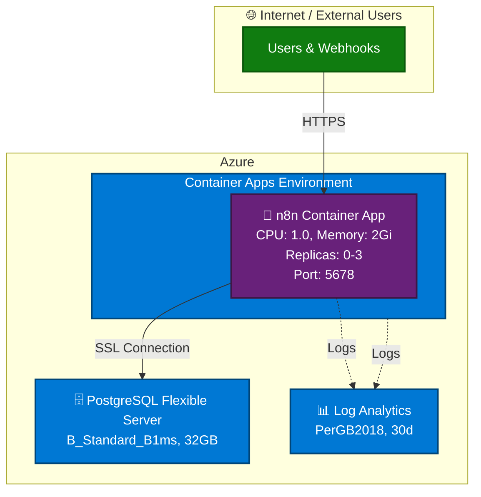

# Chapter 3: Automating n8n Deployments with GitHub Copilot Agents

In this chapter, you'll learn how to deploy production-ready infrastructure using specialized GitHub Copilot agents. You'll deploy n8n (a workflow automation platform) to Azure using either Bicep or Terraform, while GitHub Copilot agents handle the complexity of infrastructure-as-code generation, best practice validation, and automated deployment. This hands-on chapter demonstrates how AI agents can transform deployment workflows from hours to minutes.

**Prerequisites**: [Chapter 0: Course Setup](../00-course-setup/README.md), [Chapter 1: First Deployment](../01-first-deployment/README.md)

## Quick Navigation
- [Part 1: Meet the Specialized Agents](#part-1-meet-the-specialized-agents)
- [Part 2: Bicep Agent Deployment](#part-2-bicep-agent-deployment)
- [Part 3: Terraform Agent Deployment](#part-3-terraform-agent-deployment)
- [Part 4: Troubleshooting](#part-4-troubleshooting-common-issues)
- [Part 5: Assignment](#part-5-assignment)

## 🎯 Learning Objectives
- ✅ Understand when to choose the Bicep or Terraform GitHub Copilot agent for Azure work
- ✅ Practice selecting specialized agents inside GitHub Copilot Chat → [agent mode](../GLOSSARY.md#agent-mode)
- ✅ Use Azure MCP tooling (best practices, schema, deploy plans) before letting an agent create resources
- ✅ Deploy n8n into [Azure Container Apps](../GLOSSARY.md#azure-container-apps) with [PostgreSQL Flexible Server](../GLOSSARY.md#postgresql) and Log Analytics
- ✅ Verify deployments via Portal, CLI, and agent-mode queries
- ✅ Clean up all resources immediately after completing exercises

## Real-World Scenario

Your automation team wants a managed n8n instance in Azure so business users can design workflows without touching production systems. They expect AI-assisted deployments that minimize costs and must see the full [Generate → Approve → Execute → Verify workflow](../GLOSSARY.md#generate--approve--execute-workflow) using GitHub Copilot agents.

## Resource Plan

**Required tags**: `--tags environment=learning course=azure-copilot chapter=03`
**Region**: `westus` (aligns with both agent specs)
**SKUs**: [Container Apps](../GLOSSARY.md#azure-container-apps) consumption, [PostgreSQL](../GLOSSARY.md#postgresql) B_Standard_B1ms, Log Analytics PerGB2018

> **Cost Note**: This chapter deploys paid services. Clean up resources immediately after completing the exercises to minimize costs.

## Architecture Overview

This deployment creates a production-ready n8n environment on Azure with the following components:



### Why This Architecture?

This deployment uses Azure Container Apps instead of traditional App Service because Container Apps can automatically scale down to zero replicas when not in use, eliminating compute costs during idle periods. This is especially valuable for n8n, a workflow automation tool that runs background tasks and benefits from container orchestration. Container Apps also provides built-in health probe support, which prevents the platform from terminating containers before applications finish initializing.

For the database, we're using PostgreSQL Flexible Server rather than a containerized database because it provides managed backups with point-in-time restore, built-in high availability, and better performance than container storage volumes. The managed service handles encryption, SSL connections, and compliance requirements automatically, while keeping the database lifecycle independent of your application containers.

We'll use Azure Developer CLI (azd) to simplify the deployment workflow. Running `azd up` handles all resource dependencies and deployment order automatically, whether you choose Bicep or Terraform. The tool also supports post-provision hooks that configure settings like WEBHOOK_URL after the Container App's FQDN is assigned, ensuring repeatable deployments across your team.

---

## Part 1: Choosing Your Infrastructure Tool

This chapter provides two specialized GitHub Copilot agents—one for Bicep and one for Terraform. Choose the Bicep agent if your organization prefers Azure-native infrastructure-as-code. Choose the Terraform agent if you need multi-cloud portability or already use Terraform workflows.

To select an agent, open GitHub Copilot Chat (`Cmd+Shift+I` / `Ctrl+Shift+I`), set the mode to **Agent**, then select either `n8n-deployment.bicep.agent.md` or `n8n.deployment.terraform.agent.md` from the dropdown. Verify the agent name appears in your chat input area before proceeding.

### What These Agents Do

Both specialized agents validate your deployment against Azure best practices before generating any code. They automatically call Azure MCP tools to retrieve guidance on infrastructure patterns, security configurations, and resource schemas. After generating the complete project structure—including `azure.yaml`, infrastructure templates, post-provision hooks, and `.gitignore` files—the agents show you everything for review before execution.

The agents also handle resource provider registration automatically to prevent deployment conflicts, and they include post-provision hooks that configure settings like `WEBHOOK_URL` after your Container App receives its fully qualified domain name. All critical configurations are embedded, including proper health probe timeouts and PostgreSQL SSL settings, following security best practices like managed identities and HTTPS-only access.

> ⚠️ **Safety Reminder**: After you click **Continue**, the agents will run actual deployments. Always review the generated code and commands first.

### Key Differences Between Bicep and Terraform

Both approaches use azd for deployment and local state management, but they differ in syntax and tooling. Bicep uses a declarative, Azure-focused syntax with native Azure Resource Manager integration, while Terraform uses HCL (HashiCorp Configuration Language) that works across multiple cloud providers.

The Bicep agent generates encryption keys using `newGuid()` as a parameter default, while the Terraform agent uses a `random_password` resource. For Terraform specifically, you must set `resource_provider_registrations = "none"` in your provider configuration, and variable files must be named `main.tfvars.json` (not `terraform.tfvars.json`) for azd compatibility. Post-provision hooks retrieve outputs differently: Bicep uses `azd env get-value` while Terraform uses `terraform output -raw`.

Bicep has a lower learning curve if you're focused on Azure, while Terraform offers skills that transfer to other cloud platforms.

---

## Part 2: Bicep Agent Deployment

### 2.1 Why Choose Bicep

Choose the Bicep path if your team is standardizing on Azure-native infrastructure-as-code. Bicep provides first-class tooling integration with Azure and simpler syntax for Azure-only deployments, making it ideal for teams focused exclusively on the Azure ecosystem.

### 2.2 Critical Technical Details (Bicep)

**Health Probes (MOST IMPORTANT - Common Failure Point)**

n8n is a complex Node.js application that requires time to initialize. Incorrect health probe settings are the #1 cause of failed deployments:

- **Liveness probe**: `initialDelaySeconds: 60`
  - **Why**: n8n requires at least 60 seconds to start its web server after the container launches
  - **What happens if wrong**: Container Apps kills the container thinking it's unhealthy

- **Startup probe**: `failureThreshold: 30` with 10-second intervals
  - **Why**: Allows up to 5 minutes (30 × 10s = 300s) for the first startup
  - **What happens if wrong**: Container never becomes ready, stuck in "CrashLoopBackOff" state

- **Why this matters**: Without these settings, [Azure Container Apps](../GLOSSARY.md#azure-container-apps) will terminate the container before n8n finishes initializing, resulting in an endless restart loop

**Database Connection Requirements**: You must use the PostgreSQL server's fully qualified domain name (FQDN) in connection strings, not the short name. Enable SSL with `DB_POSTGRESDB_SSL_ENABLED=true` and set `DB_POSTGRESDB_SSL_REJECT_UNAUTHORIZED=false` for Azure PostgreSQL certificate validation. Use a 60-second connection timeout to handle cold starts, and configure the firewall to allow Azure services.

**Bicep-Specific Requirements**: Generate the encryption key using `param n8nEncryptionKey string = newGuid()` as a parameter default—never use `newGuid()` in variable declarations, as this causes Bicep compilation errors. Post-provision hooks use `azd env get-value` to retrieve deployment outputs.

**WEBHOOK_URL Configuration**: The WEBHOOK_URL cannot be set during initial creation due to a circular dependency with the Container App's FQDN. The post-provision hook runs automatically after `azd up` completes and updates this environment variable for you.

### 2.3 Kickoff Prompt

**Step 1**: Select the **n8n Bicep agent** in GitHub Copilot Chat:
1. Open GitHub Copilot Chat (`Cmd+Shift+I` / `Ctrl+Shift+I`)
2. Set mode to **Agent** using the dropdown at the bottom
3. From the same dropdown, select `n8n-deployment.bicep.agent.md`
4. Verify the agent name appears in your chat input area

**Step 2**: Run this prompt:
```
Create a deployment for n8n to Azure using Bicep and azd
- Region westus, environment name n8n
- Show generated Bicep code and azd commands for approval
- Include required tags: environment=learning course=azure-mcp chapter=03
```

**What the agent does** (following the Generate → Approve → Execute workflow):
1. **Generate**: Calls Azure MCP tools to get best practices and Bicep schema guidance
2. **Generate**: Creates complete project structure:
   - `infra/main.bicep` - Main infrastructure template
   - `infra/main.parameters.json` - Configuration values
   - `azure.yaml` - Azure Developer CLI configuration
   - `infra/hooks/postprovision.*` - Post-deployment automation scripts
   - `.gitignore` - Git ignore patterns
3. **Approve**: Shows you all the generated code and commands for review
4. **Execute**: After you click "Allow", runs the deployment commands

### 2.4 Review and Approve

GitHub Copilot will show you a complete diff with all commands: resource group creation, provider registration, and the full `azd up` deployment. Review the resource naming (expect `n8n-<suffix>` patterns) and verify the required tags are included before clicking **Continue**.

### 2.5 Deployment Process

Running `azd up` provisions resources in dependency order: Resource Group, Log Analytics, Container Apps Environment, Managed Identity, PostgreSQL Flexible Server, and finally the n8n Container App. The post-provision hook automatically updates the `WEBHOOK_URL` environment variable once the Container App receives its FQDN. Watch the terminal output to confirm health probe configurations are applied.

### 2.6 Verify the Deployment

Check the Azure Portal to confirm your resource group contains the Container App, PostgreSQL server and database, and Log Analytics workspace. You can also verify using the Azure CLI with `az containerapp show` and `az postgres flexible-server show`, or ask the agent directly: "List all resources tagged chapter=03".

### 2.7 Access n8n

Navigate to `https://<container-app-fqdn>` in your browser. The default admin username and password are stored in `infra/main.parameters.json`.

### 2.8 Clean Up Resources

When finished, use the agent to delete all resources: "Delete the Chapter 3 n8n resource group and all dependent resources". The agent will run `azd down` or `az group delete`. Verify deletion with `az group list --tag chapter=03`. Your local `.azure/` artifacts remain available for redeployment if needed.

---

## Part 3: Terraform Agent Deployment

### 3.1 Why Choose Terraform

Choose the Terraform path if your team uses multi-cloud infrastructure processes or already maintains Terraform modules in a registry. Terraform skills transfer across cloud providers (AWS, GCP, Azure), making this approach valuable for organizations with diverse cloud environments.

### 3.2 Critical Technical Details (Terraform)

**Health Probes (MOST IMPORTANT - Common Failure Point)**
- **Liveness probe**: `initial_delay = 60` - n8n requires at least 60 seconds to initialize
- **Startup probe**: `failure_count_threshold = 30` - allows up to 5 minutes for first startup
- **Why critical**: Without these settings, [Azure Container Apps](../GLOSSARY.md#azure-container-apps) will kill the container before n8n finishes starting, causing "CrashLoopBackOff" errors

**Database Connection Requirements**: Use the same PostgreSQL connection requirements as the Bicep path—FQDN instead of short names, SSL enabled, certificate validation configured appropriately, 60-second connection timeout, and firewall rules allowing Azure services.

**Terraform-Specific Requirements**: Set `resource_provider_registrations = "none"` in your `providers.tf` to prevent 409 conflicts during deployment. Generate encryption keys using a `random_password` resource, not `random_string`. Name your variable files `main.tfvars.json` for azd compatibility—not `terraform.tfvars.json`. Post-provision hooks navigate to `.azure/${AZURE_ENV_NAME}/infra` and use `terraform output -raw` to retrieve deployment values.

**WEBHOOK_URL Configuration**: The post-provision hook handles this automatically after `azd up` completes, retrieving the Container App FQDN from Terraform outputs and updating the environment variable.

### 3.3 Deploy with Terraform

Select the **n8n Terraform** agent and run this prompt:
```
Deploy the Chapter 3 n8n stack with Terraform and azd
- Region westus, environment name n8n
- Show Terraform plan and azd commands for approval
- Follow the repository conventions for tags and cleanup guidance
```

The agent retrieves Azure and Terraform best practices, then generates all required files: `main.tf`, `variables.tf`, `providers.tf`, `outputs.tf`, hooks, and `.gitignore`. It ensures `resource_provider_registrations = "none"` is set in the provider configuration.

### 3.4 Review and Execute

Review the agent's plan, which includes `azd init`, provider registration, and `azd up` commands. Check that secrets are marked as sensitive outputs in the Terraform configuration. After clicking **Continue**, `azd up` runs `terraform init/plan/apply` inside `.azure/<env>/infra`, and the post-provision hooks automatically configure `WEBHOOK_URL` using the Container App FQDN from Terraform outputs.

### 3.5 Verify and Clean Up

Verify the deployment using the Azure Portal, Azure CLI (`az containerapp revision list`, `az postgres flexible-server db list`), or Terraform outputs (`cd .azure/n8n/infra && terraform output`). When finished, ask the agent to "Run azd down for the n8n Terraform environment" and verify all resources are deleted with `az group list --tag chapter=03`.

---

## Part 4: Troubleshooting Common Issues

### Issue 1: Container Keeps Restarting (CrashLoopBackOff)

If the Container App shows "Provisioning" indefinitely and replica counts cycle between 0 and 1, the health probes are likely terminating the container before n8n finishes initializing.

Verify the health probe configuration in your generated infrastructure code. For Bicep, check `infra/main.bicep` for `livenessProbe.initialDelaySeconds: 60` and `startupProbe.failureThreshold: 30`. For Terraform, look for `initial_delay = 60` and `failure_count_threshold = 30` in `infra/main.tf`.

Check the container logs with `az containerapp logs show --name <app-name> --resource-group <rg-name> --follow` to see if n8n is starting successfully before the health checks begin.

### Issue 2: Database Connection Failures

If n8n logs show "ECONNREFUSED", "connection timeout", or "SSL connection required" errors, verify that the `DB_POSTGRESDB_HOST` environment variable contains the full FQDN (like `n8n-pg-abc123.postgres.database.azure.com`) instead of just the short name. Check this with `az containerapp show --query "properties.template.containers[0].env[?name=='DB_POSTGRESDB_HOST'].value"`.

Confirm that `DB_POSTGRESDB_SSL_ENABLED` is set to `"true"` and that PostgreSQL firewall rules allow Azure services (check with `az postgres flexible-server firewall-rule list`).

### Issue 3: WEBHOOK_URL Not Configured

If n8n loads but static assets fail to load or the interface appears unstyled, the `WEBHOOK_URL` environment variable may not be configured. Verify with `az containerapp show --query "properties.template.containers[0].env[?name=='WEBHOOK_URL'].value"`.

If it's missing, manually run the post-provision hook: `./infra/hooks/postprovision.sh` for macOS/Linux or `./infra/hooks/postprovision.ps1` for Windows. You may need to make the script executable first with `chmod +x infra/hooks/postprovision.sh`.

### Issue 4: 409 Conflict Errors (Terraform Only)

If `azd up` fails with "409 Conflict" errors during Terraform deployment, ensure `providers.tf` contains `resource_provider_registrations = "none"` in the azurerm provider block. If this is missing, manually register the required providers before deployment:

```bash
az provider register --namespace Microsoft.App
az provider register --namespace Microsoft.DBforPostgreSQL
az provider register --namespace Microsoft.OperationalInsights
```

Verify registration with `az provider show --namespace Microsoft.App --query "registrationState"` (should return "Registered").

### Issue 5: Bicep `newGuid()` Errors

If Bicep deployment fails with "newGuid() can only be used as parameter default value", ensure your encryption key is defined as `param n8nEncryptionKey string = newGuid()` in `main.bicep`—never use `newGuid()` in variable declarations or expressions.

### Getting Help

If issues persist, review your generated code against the agent specifications in `.github/agents/`, run `azd up --debug` for detailed logs, or switch GitHub Copilot to Ask mode to troubleshoot specific error messages.

---

## Part 5: Assignment

Complete the infrastructure-as-code path you didn't follow during the walkthrough. Document your prompts, approval decisions, and any adjustments needed. Capture verification evidence using the Azure Portal, Azure CLI, and agent queries. Write a brief reflection on how the agent workflow affected deployment speed and complexity.

**Success criteria**: Agent selected correctly, best practices reviewed, `azd up` succeeded without manual IaC edits, n8n accessible over HTTPS, verified using three methods, and all resources cleaned up with `azd down`.

**Cleanup checklist**: Run `azd down`, verify `az group list --tag chapter=03` shows nothing, confirm resource group deletion in Portal, keep `.azure/` artifacts locally for future deployments, and secure any saved passwords or encryption keys.

---

## Key Takeaways

Specialized GitHub Copilot agents embed domain knowledge for Bicep and Terraform, allowing you to focus on deployment intent rather than infrastructure syntax. Every deployment follows the Generate → Approve → Execute → Verify workflow—never skip the approval step. Azure MCP tools automatically enforce best practices and governance policies, while post-provision hooks handle runtime-dependent configurations like WEBHOOK_URL. Always clean up resources immediately after learning to reinforce responsible cloud resource management.

---

## What's Next?

**Upcoming Chapters (Currently Being Refreshed)**

The next chapters are being updated to align with the agent mode workflow. Until they're ready, you can:

1. **Explore archived chapters** in the [`old/`](../old) directory for additional Azure scenarios
2. **Practice the patterns** from Chapters 0-3 with your own projects
3. **Experiment with** the Bicep and Terraform agents from Chapter 3 on other OSS applications

**Stay tuned** for Chapter 4 and beyond, which will continue building on the Generate → Approve → Execute workflow you've mastered!
